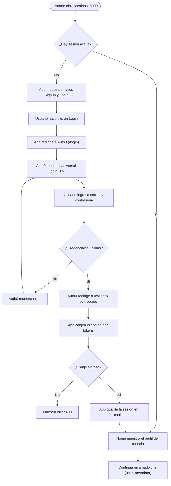

# Auth0-itm-guia3
Taller Guía 3 - Aplicaciones y servicios web (Auth0)

## Diagrama de flujo

```mermaid
flowchart TD
    A([Usuario abre localhost:5000]) --> B{¿Hay sesión activa?}
    B -- Sí --> I[Home muestra el perfil del usuario]
    B -- No --> C[App muestra enlaces Signup y Login]
    C --> D[Usuario hace clic en Login]
    D --> E["App redirige a Auth0 (/login)"]
    E --> F[Auth0 muestra Universal Login ITM]
    F --> G[Usuario ingresa correo y contraseña]
    G --> H{¿Credenciales válidas?}
    H -- No --> J[Auth0 muestra error]
    J --> F
    H -- Sí --> K["Auth0 redirige a /callback con código"]
    K --> L[App canjea el código por tokens]
    L --> M{¿Canje exitoso?}
    M -- No --> N[Muestra error 400]
    M -- Sí --> O[App guarda la sesión en cookie]
    O --> I
    I -.-> P["Continúa mi amado cris (user_metadata)"]
```